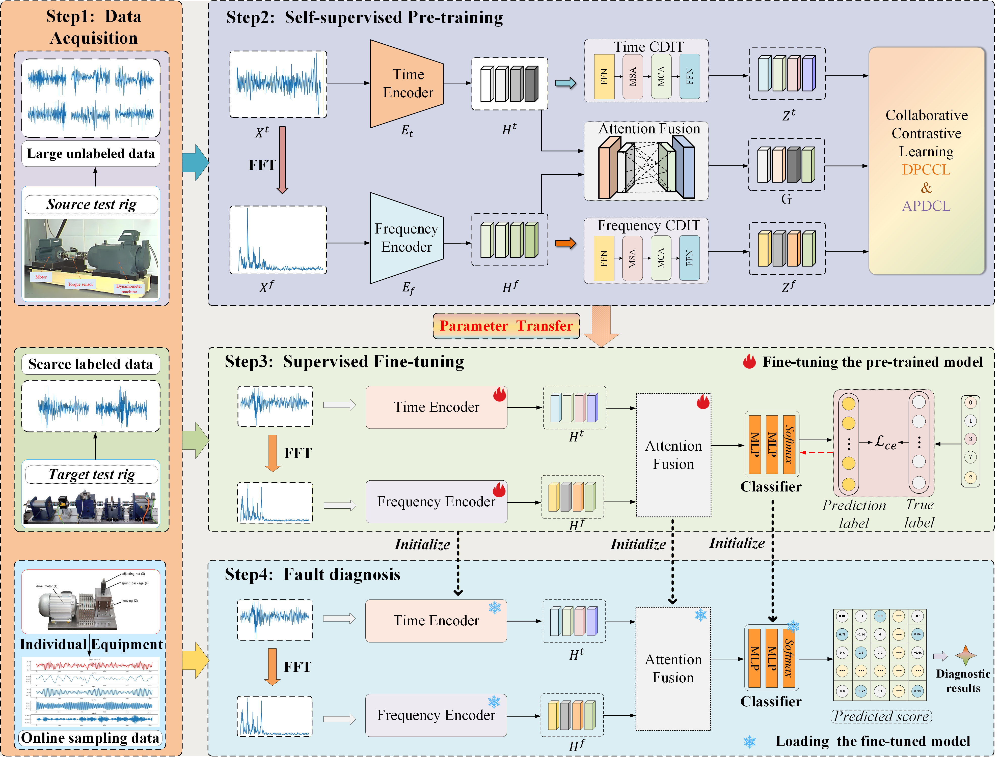

# PDC-CFN

Implementation of the paper "**Prototype-Driven Dual-Perspective Collaborative
Contrastive Fusion Network for Rotating Machinery
Fault Diagnosis**" by Dazheng Peng, Zhenqiu Shu, Zhengtao Yu.


### Model Framework


<p align="center">
  
</p>


## Requirements

please install the following packages

* torch>=2.0.1 + cuda11.8
* numpy>=1.24.1
* pytorch-ignite>=0.5.0.post2
* thop>=0.1.1
* scikit-learn>=1.3.2

## Download datasets

- **Dataset 1: PU bearing dataset ([raw dataset](https://mb.uni-paderborn.de/kat/forschung/datacenter/bearing-datacenter/))**


- **Dataset 2: CWRU bearing dataset ([raw dataset](https://engineering.case.edu/bearingdatacenter))**


- **Dataset 3: XJTU gearbox dataset ([raw dataset](https://github.com/HazeDT/PHMGNNBenchmark))**


- Detailed processing steps are available in the [DL-based Intelligent Diagnosis Benchmark](https://github.com/ZhaoZhibin/DL-based-Intelligent-Diagnosis-Benchmark) and [TFAI](https://github.com/DaxingFu/TFAI). 
- The processed data is saved in `.pt` format.


### Project Structure
please download the datasets and place them in the dataset folder:

```
PDC-CFN/
│
├── config_file/ # Configuration files
│ └── configs.py
│
├── dataset/ # Dataset loading and preparation
│ ├── dataset1/ # e.g., PU dataset
│ ├── dataset2/ # e.g., CWRU dataset
│ ├── dataset3/ # e.g., XJTU-gearbox dataset
│ └── dataloader.py # Unified data loader
│
├── img/ # Model figures
│ └── PDC-CFN.png
│
├── loss/ # Loss function definitions
│ └── loss.py
│
├── model/ # Model components
│ ├── baseModels.py # Conv layers, Projection layers
│ ├── encoder.py # Feature encoders
│ └── model.py # Overall model architecture
│
├── utils/ # Utility functions
│ ├── utils.py
│
├── worker/ # Pre-train/Fine-tune and Test workflows
│ └── worker.py
│
├── main.py # Main entry point
└── README.md # Project documentation

```

## Usage example

git clone or download the repository

cd PDC-CFN

---

### Case 1: Conventional Fault Diagnosis Tasks
```
- Pre-training:
python main.py --mode train --source-dataset PU  --target-dataset PU --classes 13 --run  PU
- Fine-tuning:
python main.py --mode finetune --source-dataset PU  --target-dataset PU  --classes 13 --run  PU  --percent 1
- Testing:
python main.py --mode test --source-dataset PU  --target-dataset PU  --classes 13 --run  PU
```

### Case 2: Cross-equipment Fine-Tuning Task

```
- Pre-training:
python main.py --mode train --source-dataset PU  --target-dataset CWRU --classes 13 --run  PU_2_CWRU
- Fine-tuning:
python main.py --mode finetune --source-dataset PU  --target-dataset CWRU  --classes 10 --run  PU_2_CWRU
- Testing:
python main.py --mode test --source-dataset PU  --target-dataset CWRU  --classes 10 --run  PU_2_CWRU
```
### Case 3: One-shot Fine-Tuning Task

```
Uncomment the sample_one_signal_per_class function in dataloader.py
```
```
- Pre-training:
python main.py --mode train --source-dataset PU  --target-dataset PU --classes 13 --run  PU
- Fine-tuning:
python main.py --mode finetune --source-dataset PU  --target-dataset PU  --classes 13 --run  PU
- Testing:
python main.py --mode test --source-dataset PU  --target-dataset PU  --classes 13 --run  PU
```

---

## Contact

If you have any questions about this repository, feel free to contact me at: **1438759640@qq.com**


## Citation

If you find this work helpful, please consider citing:

```bibtex
@article{shu2025time,
  title={Prototype-Driven Dual-Perspective Collaborative Contrastive Fusion Network for Rotating Machinery Fault Diagnosis},
  author={Peng, Dazheng and Shu, Zhenqiu and Yu, Zhengtao},
  journal={Measurement},
  year={2026},
  publisher={Elsevier}
}
